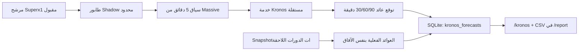

# تكامل Kronos مع Superx1

هذا التكامل يستخدم Kronos كإشارة **Shadow قابلة للقياس**، لا كبوابة أو توصية
ولا كمنفّذ صفقات. الهدف هو معرفة هل يضيف النموذج قيمة فعلية فوق استراتيجية
Superx1 الحالية قبل السماح له بالتأثير فيها.

## ما بُني



- `runner_scanner/kronos_shadow.py`: تجهيز OHLCV، عميل HTTP، منع تكرار لكل
  شمعة 5 دقائق، وطابور خلفي محدود لا يحجب دورة المسح.
- `services/kronos_inference/`: خدمة استدلال مستقلة، تحميل lazy للأوزان،
  تحقق صارم، Bearer، وحدود للطلب.
- `runner_scanner/state.py`: جدول مستقل للتوقعات وإصدارات النموذج والنتائج
  الفعلية وأوقات الطلب/الاستلام، مع ترحيل SQLite ذري، بلا تلويث سجل قرار
  التنبيه. أي تعارض في مخطط Shadow يعطّل Kronos وحده ويُبقي مخزن البوت الأساسي.
- `runner_scanner/kronos_metrics.py`: دقة الاتجاه، MAE، و**lift مقابل خط أساس
  صعود دائم** لأن مرشحي الماسح صاعدون أصلًا.
- `/kronos`: تقرير حي. و`/report` يرفق `kronos_shadow_YYYY-MM-DD.csv` مسطحًا
  صفًا لكل أفق لتدقيقه خارجيًا.

## تشغيل الخدمة محليًا

نفّذ من جذر Superx1، وببيئة Python منفصلة عن الماسح:

```bash
git clone https://github.com/shiyu-coder/Kronos.git /opt/kronos
git -C /opt/kronos checkout 67b630e67f6a18c9e9be918d9b4337c960db1e9a

python3.11 -m venv .venv-kronos
. .venv-kronos/bin/activate
python -m pip install -r services/kronos_inference/requirements.txt

export KRONOS_REPO_PATH=/opt/kronos
export KRONOS_API_TOKEN='سر-طويل-عشوائي'
python -m services.kronos_inference
```

فحص خفيف لا يحمّل الأوزان:

```bash
curl http://127.0.0.1:8080/health
curl -H 'Authorization: Bearer سر-طويل-عشوائي' http://127.0.0.1:8080/ready
```

ثم أضف إلى بيئة الماسح:

```dotenv
KRONOS_SHADOW_ENABLED=true
KRONOS_SERVICE_URL=http://127.0.0.1:8080
KRONOS_SERVICE_TOKEN=سر-طويل-عشوائي
KRONOS_CONTEXT_DAYS=14
KRONOS_LOOKBACK=512
KRONOS_PRED_LEN=18
KRONOS_HORIZONS=6,12,18
```

إذا كانت الخدمة على مضيف مختلف، استخدم HTTPS؛ عميل Superx1 يرفض برمجيًا إرسال
Bearer عبر HTTP إلى عنوان غير loopback. كذلك يرفض خادم الاستدلال الاستماع على
عنوان غير loopback ما لم يُضبط `KRONOS_API_TOKEN`. العقد الكامل والإعدادات في
`services/kronos_inference/README.md`.

## معنى القياس

- `returns_pct["6"]`: عائد الإغلاق المتوقع بعد 6 شموع، أي 30 دقيقة.
- `actual_return_pct`: عائد Snapshot قريب من الموعد نفسه نسبةً إلى آخر إغلاق
  5 دقائق أُرسل للنموذج.
- حقيقة السعر تستخدم `lastTrade` وطابع الصفقة نفسه فقط. يبقى إغلاق aggregate
  الدقيقة fallback صالحًا للماسح، لكنه لا يُستخدم label لأن طابعه هو بداية
  النافذة لا وقت صفقة الإغلاق. هذا **proxy زمني** قريب من الموعد، وليس إغلاق
  شمعة 5 دقائق الرسمي؛ يصلح لجمع Shadow وتشخيصه، لكنه لا يكفي وحده للترقية.
- إذا فاتت عينة الموعد بأكثر من 3 دقائق، تُسجّل النتيجة `null` بدل نسب سعر
  متأخر إلى أفق قديم. تُخزن سماحية الرصد مع كل توقع، وكذلك طابع الصفقة التي
  كوّنت الحقيقة لكل أفق، فلا يغيّر restart بإعداد جديد سياسة صف قديم.
- يُقاس عمر آخر شمعة عند **التنفيذ الفعلي** لا عند بداية دورة المسح. تحفظ
  `requested_at` و`received_at`، ويُهمل أي استدلال اكتمل بعد أول أفق كي لا
  يتحول الاختبار إلى توقع رجعي. تستخدم حمولة النموذج cutoff إغلاق قرار
  Superx1 نفسه، وأي مهمة انتهت نافذة حداثتها في الطابور تُسجل كتجاوز قبل طلب
  الشموع كي يُستنزف backlog سريعًا.
- لا يُنشأ مسار توقع يمتد خارج نهاية جلسته، ويُحترم الإغلاق المبكر. تُخزّن
  الجلسة وتُعرض المقاييس لكل جلسة منفصلة.
- `directional_accuracy_pct`: هل أصاب اتجاه الإشارة؟
- `baseline_accuracy_pct`: دقة توقع «السهم سيصعد» دائمًا داخل هذه المجموعة
  الصاعدة أصلًا.
- `directional_lift_pp`: الفرق بين الاثنين؛ هو أهم من الدقة الخام.
- `mae_pct_points`: متوسط خطأ مقدار العائد بالنقاط المئوية.
- يحسب التقرير عدد أيام التداول **لكل أفق منفصلًا**؛ اكتمال أفق 30 دقيقة لا
  يُحتسب خطأً كتغطية لأفق 90 دقيقة. يقرأ **كل** سجلات أحدث 30 يوم تداول
  مسجّلًا بلا قطع عند 10,000، كي تبقى بوابة 20 يوم قابلة للتدقيق. المفتاح
  المتطابق يُحدّث idempotently، ويظهر آخر فشل بحسب وقت الكتابة حتى لو بقيت
  أحدث تجربة ناجحة أقدم منه. كما يعرض ضغط الطابور وفقد العينة بالامتلاء منذ
  إقلاع العملية، ويحفظ كل مرشح فاته الاستدلال بسبب امتلاء الطابور كسجل
  `skipped`، وكذلك المهام المنتظرة عند الإيقاف، كي لا تختفي فجوة التغطية بعد
  restart. هذه **سجلات محاولات**: إذا نجحت محاولة لاحقة لنفس الرمز/الإغلاق فقد
  يبقى سجل الامتلاء بجانب النجاح، ولا يجوز تفسير عدد السجلات كعدد فرص فريدة.
  القراءة والتصدير streaming بدفعات، فلا تُحمّل نافذة الأيام كلها ثم تضاعفها
  بعدد الآفاق في الذاكرة؛ ذاكرة الملخص تنمو بعدد هويات التجارب، لا بعدد الصفوف.

الدقة الاتجاهية لا تساوي ربحًا، وMAE لا يشمل الانزلاق أو السبريد أو زمن التنفيذ.

## سياسة الترقية المقترحة

لا تحوّل Kronos إلى فلتر حي لمجرد أن أول عينة تبدو جيدة. بوابة ترقية محافظة:

1. backfill لإغلاق aggregate 5 دقائق الرسمي عند كل أفق وإعادة المقاييس عليه؛
   `lastTrade` الحالي لا يُعامل ground truth نهائيًا.
2. ما لا يقل عن 200 نتيجة فعلية صالحة لكل أفق، موزعة على 20 يوم تداول أو أكثر.
3. `directional_lift_pp` موجب في نوافذ زمنية متتابعة، وليس محمولًا على أيام قليلة.
4. الحد الأدنى لفاصل ثقة bootstrap بنسبة 95% للـlift أكبر من صفر على CSV المصدر.
5. محاكاة بعد السبريد والانزلاق والتأخير ما زالت أفضل من Superx1 بلا Kronos.
6. تحليل كل `experiment_id` منفصلًا؛ هويته تشمل معرّفات ومراجعات النموذج
   والـtokenizer، commit مصدر Kronos، بصمة مصدر خدمة الاستدلال، الجهاز،
   `max_context`، المنطقة الزمنية، `lookback` و`pred_len` والآفاق، وبصمة كود
   تجهيز/التقاط بيانات Superx1 مع قيمتي حداثة السياق وسماح observation،
   وبصمة محافظة لكود وقيم اختيار المرشح الفعلية (ومنها cadence والبوابات
   والدرجات). لذلك يفتح تغيير استراتيجية Superx1 cohort جديدًا بدل خلط
   توزيعين. يعرض `/kronos` أحدث تجربة ناجحة فقط، ويفصل جلساتها، مع إبقاء أحدث
   عطل ظاهرًا.
7. أول ترقية تكون **bonus صغيرًا للدرجة في A/B**، لا رفضًا صارمًا ولا تعديلًا
   للوقف والأهداف. العودة إلى Shadow فورية إذا اختفى الـlift.

## لماذا لم يُربط كبوابة الآن؟

Kronos نموذج شموع عام، بينما Superx1 يختار أسهم زخم أمريكية صغيرة ومنحازة
للصعود. الاختبارات المجتمعية المنشورة لا تثبت حافة ثابتة في هذا التوزيع:

- [مناقشة #355](https://github.com/shiyu-coder/Kronos/issues/355) تعرض نتائج
  intraday أمريكية متفاوتة وليست اعتمادًا إنتاجيًا.
- [مناقشة #375](https://github.com/shiyu-coder/Kronos/issues/375) تشير إلى أن
  الإشارة بعد التكاليف والمعايرة تحتاج تحققًا مستقلًا.
- [مناقشة #307](https://github.com/shiyu-coder/Kronos/issues/307) تسأل عن أثر
  إصلاح تسرب بيانات على checkpoints المنشورة؛ لذلك ثبّتنا الإصدارات وسجلناها.

كذلك لا تُعامل تشتت عينات التوقع كـ«وقف» أو نطاق ثقة معاير بلا اختبار coverage
فعلي. ولهذا يبقى الوقف ومنطق المخاطر الحاليان مستقلين.

## النشر والتشغيل

- لا تثبّت PyTorch والأوزان داخل عامل Superx1 الحالي؛ شغّل الخدمة منفصلة كي
  لا يقتل ضغط الذاكرة حلقة التنبيه.
- أول توقع أبطأ لأنه يحمل الكود والأوزان؛ `/health` لفحص حياة العملية و`/ready`
  لفحص المسار والاعتمادات وإصداراتها الدقيقة بلا تحميل الأوزان. يعاد الحارس
  نفسه في مسار أول توقع، فلا يتجاوزه عميل لم يستدعِ `/ready`. نتيجة الجاهزية
  مخزنة 30 ثانية لتجنب تشغيل Git لكل probe، و`/ready` يتطلب Bearer متى ضُبط
  السر.
- عميل الماسح يقرأ رد الخدمة streaming ضمن حد حجمي صلب؛ الرد المتضخم أو
  المعطوب يتحول إلى خطأ Shadow ولا يستهلك ذاكرة الماسح بلا حد.
- قِس RSS وp95 للاستدلال على جهازك قبل اختيار حجم الخادم؛ لا تفترض أن خطة
  الماسح الصغيرة مناسبة لخدمة النموذج.
- صورة Docker تخبز الأوزان والـtokenizer بالمراجعات المثبتة وتمنع وصول Hub
  وقت التشغيل؛ إعادة البناء وحدها تعيد تنزيلها، ولا يلزم قرص cache دائم.
- أبقِ الخدمة خلف HTTPS وBearer، ولا تسجل التوكن أو جسم الطلب كاملًا.
- احتفظ بترخيص Kronos عند تضمين checkout في صورة نشر؛ راجع
  `services/kronos_inference/THIRD_PARTY_NOTICES.md`.
- صورة `services/kronos_inference/Dockerfile` تبني checkout المثبت، تخبز
  الأوزان، وتشغّل الخدمة كمستخدم غير root. يضيف `render.yaml` الخدمة بخطة
  `standard` (2GB)، ويولد Bearer عشوائيًا ثم يمرره وعنوان HTTPS إلى العامل
  عبر مراجع Blueprint؛ لا يُكتب السر في Git. القياس الفعلي عند الإعداد
  الإنتاجي الكامل (512 شمعة، توقع 18) بلغ 445.81MiB و2.35ث للتحميل البارد
  و0.93ث للتوقع الدافئ على CPU محلي. يبقى النشر التلقائي معطلًا للخدمتين.
- يبقى `services/kronos_inference/render.kronos.yaml.example` بديلًا مستقلًا
  لمن يريد نشر خدمة Kronos وحدها دون إدارة عامل الماسح في Blueprint نفسه.

## الرجوع الآمن

```dotenv
KRONOS_SHADOW_ENABLED=false
```

هذا يوقف إنشاء توقعات جديدة فقط. تبقى البيانات التاريخية في SQLite، وتظل
كل بوابات Superx1 ودرجاته وتنبيهاته كما كانت قبل التكامل.
